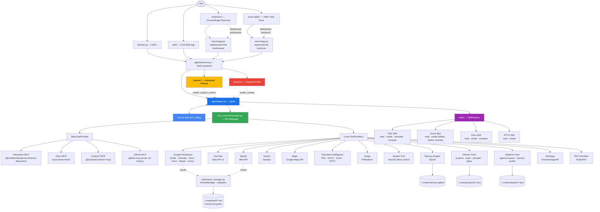
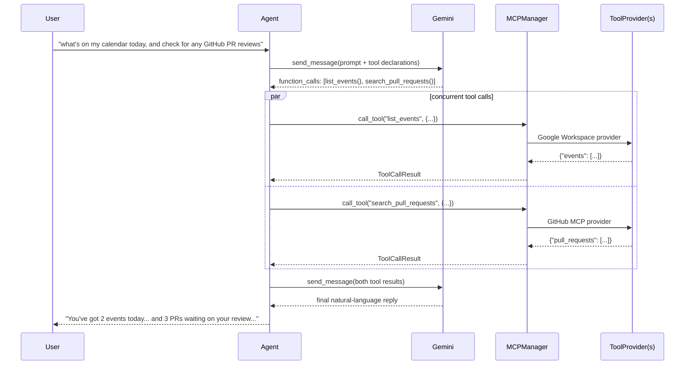
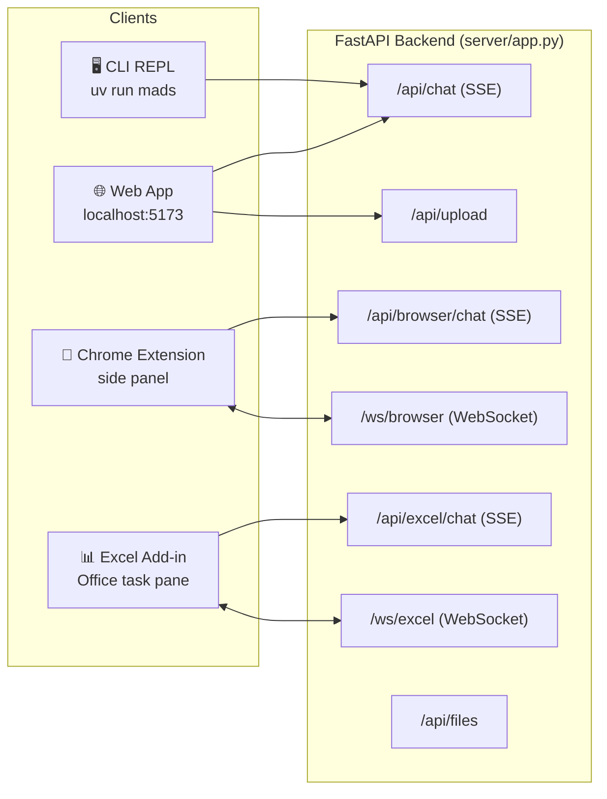
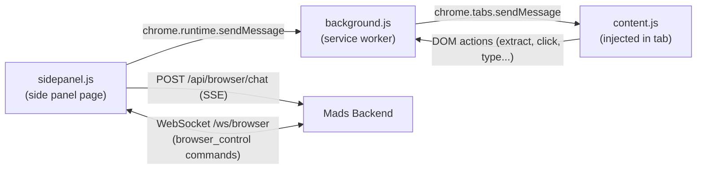
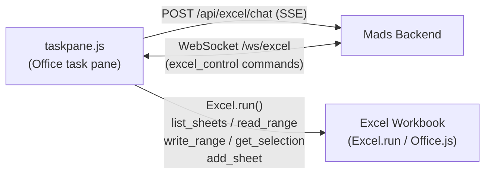
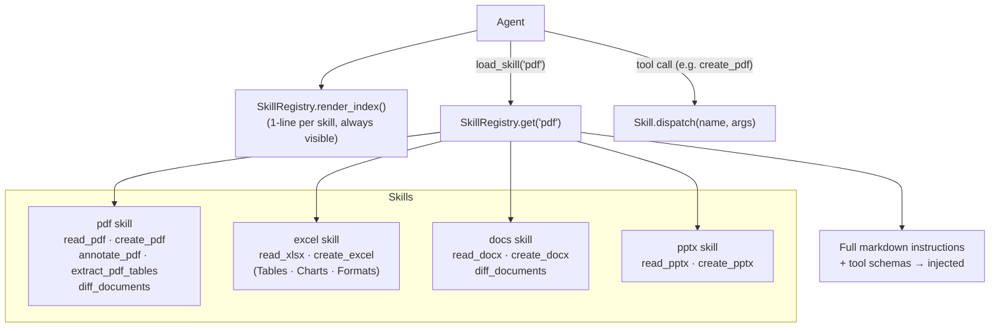
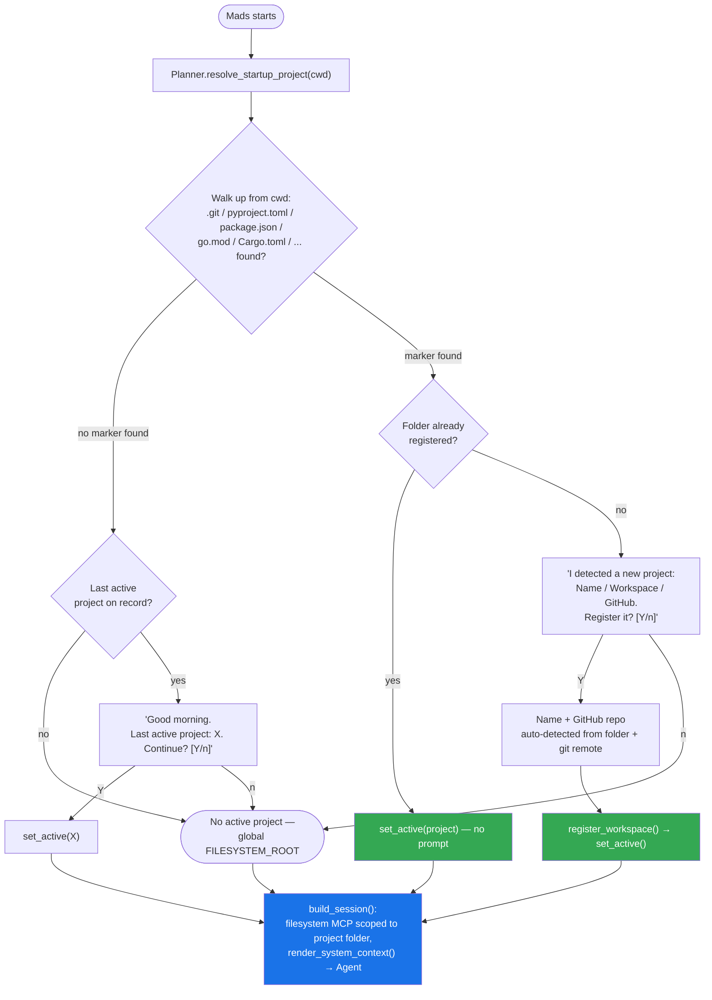
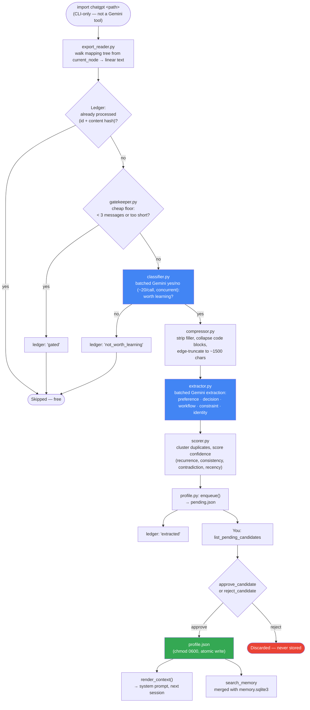

# Mads

Mads is a personal AI Chief of Staff — an AI operating system built around one core idea:
**one brain, many tools.** Gemini decides what to do and which capability to use; there is no
keyword routing, no multi-agent orchestration, and no hardcoded "if X then call Y" logic
anywhere in the codebase. Every capability — reading a file, searching Gmail, controlling Spotify,
checking battery status, planning your day, recalling something you told ChatGPT a year ago,
annotating a PDF, or reading the cells in a workbook open in Excel — is just a function Gemini
can choose to call.

Mads runs everywhere you work: as a **CLI REPL**, a **web chat app**, a **Chrome / Edge browser
extension** (side panel that can see and act on the page you're looking at), and a **Microsoft
Excel add-in** (task pane that can read and write the workbook that's currently open).

Two things sit above the tool layer without breaking that model: **Advanced Planner**, which gives
Mads standing awareness of your active project, tasks, and prompts; and **Adaptive Intelligence**,
which learns durable facts about you from imported conversation history, subject to your explicit
approval before anything is trusted.

## Why this architecture

Most "AI assistant" projects either hardcode intent → action mappings, or reach for multi-agent
frameworks before they're needed. Mads deliberately avoids both:

- **No keyword routing.** Nothing in this codebase inspects the user's message for words like
  `"email"` or `"volume"` to decide what to do. Gemini's function calling makes that decision
  every time, using the natural-language tool descriptions as its only guide.
- **No multi-agent orchestration.** There is one Gemini chat session per run. When a task needs
  several independent lookups (e.g. Research Mode fetching from Context7, GitHub, the web, and
  YouTube at once), those are *concurrent tool calls within the same reasoning turn*
  (`asyncio.gather`), not separate agent instances with their own reasoning loops.
- **Every capability looks the same to the agent.** Whether a tool spawns a real MCP server
  subprocess, calls a REST API directly, shells out to `osascript`, or calls `Excel.run()` in the
  task pane, the agent only ever sees a `ToolProvider`: `list_tools()` + `call_tool()`. It has no
  idea which is which, and doesn't need to.
- **Skills load on demand, not up front.** Document-generation capabilities (PDF, PPTX, Excel,
  Docs) are bundled into self-contained `Skill` objects. Gemini always sees a one-line index of
  available skills. Full tool schemas and usage instructions only load for a skill once it's
  actually invoked, keeping the context window clean on turns that don't need them.
- **Intelligence layers orchestrate, they don't replace.** Advanced Planner and Adaptive
  Intelligence sit *above* the tool layer — they shape what the agent already knows going into a
  conversation and expose a few extra tools of their own, but they never bypass the same
  `ToolProvider` interface everything else uses.

## Architecture



**The agent never branches on tool identity.** `Agent.send()` sends a message, and for every
function call Gemini requests in that turn, dispatches to `MCPManager.call_tool(name, args)` —
that's the entire routing logic. `MCPManager` resolves `name` to whichever `ToolProvider`
registered it and returns the result. Independent calls in the same turn run concurrently.

## Request lifecycle



## Surfaces

Mads exposes the same agent over four distinct surfaces. All four talk to the same backend
(`server/app.py`) and are backed by the same session — the same Gemini context, the same tools,
the same memory.



### Chrome / Edge Extension (`extension/`)

A Manifest v3 extension that adds a **side panel** to any tab. The side panel:

- Connects to the Mads backend over **WebSocket** (`/ws/browser`) — the same
  `WebSocketCommandBridge` pattern the Excel add-in uses.
- Sends chat messages to `/api/browser/chat` using **SSE-over-fetch** (same streaming pattern
  as the web app, since `EventSource` can't do POST).
- Relays `browser_control` commands (`extract_page`, `navigate`, `click_element`, `type_text`,
  `scroll_to`, `go_back`) from the backend to **`background.js`** via `chrome.runtime.sendMessage`.
  Only the background service worker has `chrome.tabs` / `chrome.scripting` access; the side panel
  page owns the socket so it isn't dropped on service-worker restart.
- **Auto-reconnects** with exponential backoff (max 15 s delay) on close/restart — no manual
  reconnect button needed.



### Microsoft Excel Add-in (`excel-addin/`)

An Office.js task pane add-in that embeds Mads **inside Excel**. Unlike the browser extension,
this runs in the same Office process as the workbook, so it can call `Excel.run()` directly:

- Connects over **WebSocket** (`/ws/excel`) to receive `excel_control` commands from the agent.
- Executes: `list_sheets`, `read_range`, `write_range`, `get_selection`, `add_sheet`.
- Handles **whole-row/column shorthand** (`"2:2"`, `"A:A"`) that Office.js doesn't natively
  support — automatically translates them to real A1 addresses against the sheet's used range.
- Returns **rich error info** from `OfficeExtension.Error` objects (code + debugInfo) instead of
  generic "unexpected error" messages.
- Uses `Office.onReady()` before touching any Office.js API, and auto-reconnects the WebSocket
  with the same backoff logic as the browser extension.



## Skill System

Document-generation capabilities are bundled as **Skills** — self-contained modules each providing
their own usage instructions and tool schemas. The agent always sees a compact one-line index;
full schemas only load when a skill is actually invoked, keeping the context lean.



| Skill | Key tools |
|---|---|
| **pdf** | `read_pdf` (with OCR fallback), `create_pdf` (headings, tables, images, page breaks), `annotate_pdf` (circles + text on existing PDFs), `extract_pdf_tables`, `diff_documents` |
| **excel** | `read_xlsx`, `create_excel` (real Tables, number formats, conditional formatting, native charts) |
| **docs** | `read_docx`, `create_docx`, `diff_documents` |
| **pptx** | `read_pptx`, `create_pptx` |

## Advanced Planner

Mads knows which project you're working on the way a shell knows your current directory — you
don't tell it, it detects it.



- **Workspace discovery, not manual registration.** Launch Mads from inside any folder with a
  `.git`, `pyproject.toml`, `package.json`, `go.mod`, `Cargo.toml`, or similar marker, and
  `Planner.resolve_startup_project()` either silently activates it (if already known) or offers
  to register it (name and GitHub repo auto-detected from the folder and its git remote — never
  asked for).
- **Project-scoped everything.** Once a project is active, the filesystem MCP server, tasks, and
  prompts are all scoped to it. Switching projects (`use project <name>`) tears down and rebuilds
  the whole tool session around the new scope.
- **Tasks** (`planner/task_manager.py`): priority, status (open/in-progress/blocked/done), due
  dates, tags — stored per-project at `~/.mads/projects/<slug>/tasks.json`.
- **Prompt library** (`planner/prompt_library.py`): reusable prompt templates as Markdown +
  frontmatter, either global (`~/.mads/prompts/global/`) or project-scoped
  (`~/.mads/projects/<slug>/prompts/`).
- **Planning Engine** (`planner/planning_engine.py`): rule-based (no extra LLM call) — ranks open
  tasks by overdue → due-today → priority → recency, and surfaces a suggested prompt and next
  task.
- **Dashboard** (`planner/dashboard.py`): project identity, task counts and progress, current git
  branch, recent commits, recent documents, recommended next task — all computed fresh on each
  call, never cached.

Try it: `dashboard` and `plan` as REPL commands, or just ask Mads directly — "what should I work
on today?" reaches the same Planning Engine through the `daily_plan` tool.

## Adaptive Intelligence

Mads can learn who you are and how you work from a ChatGPT export — but nothing it extracts is
trusted until you say so.



**Pipeline** (`adaptive/pipeline.py`), run via the CLI-only `import chatgpt <path>` command
(deliberately *not* a tool Gemini can trigger on its own — it's a slow, real-cost bulk job):

1. **Read** (`export_reader.py`) — walks each conversation's `mapping` tree from `current_node`
   back to root, reconstructing the linear conversation as currently visible in ChatGPT's UI.
2. **Ledger check** (`ledger.py`) — skips conversations already processed (by id + content hash),
   so re-running import against the same export after the first pass costs nothing.
3. **Gate** (`gatekeeper.py`) — a cheap, non-LLM floor that drops trivially short/empty
   conversations before spending any API call on them.
4. **Classify** (`classifier.py`) — batched Gemini calls (~20 conversations/call, run
   concurrently) ask a plain yes/no: does this conversation contain anything durable worth
   learning?
5. **Compress** (`compressor.py`) — strips filler/greetings, collapses code blocks, edge-truncates
   long conversations to ~1500 characters before the more expensive extraction call.
6. **Extract** (`extractor.py`) — batched extraction into five categories: **preference**,
   **decision**, **workflow**, **constraint**, and **identity** (name, institution, contact info —
   always extracted when present, even from a one-off task).
7. **Score** (`scorer.py`) — clusters near-duplicate candidates (a fact restated five different
   ways becomes one entry), scores confidence from recurrence, consistency, detected
   contradictions (penalized), and a slight recency boost.
8. **Approval queue** (`profile.py`) — every scored candidate lands in a pending queue. **Nothing
   reaches the Adaptive Profile without explicit approval** — `list_pending_candidates`,
   `approve_candidate`, `reject_candidate` are ordinary chat tools.

Once approved, a fact is folded into `AdaptiveProfile.render_context()`, which reaches the system
prompt the same way Planner's project context does — and into `search_memory`, which searches
*both* `memory.sqlite3` (things you told Mads directly) and the Adaptive Profile (things learned
from imported history) as one merged, relevance-ranked result set.

Storage lives at `~/.mads/adaptive/`: `pending.json` (awaiting review), `profile.json` (approved,
`chmod 0600`), `ledger.json` (import bookkeeping). All writes go through an atomic
temp-file-then-`os.replace()` path — concurrent tool calls in the same turn (Gemini can fire
several `approve_candidate` calls at once) can no longer corrupt these files.

## What's inside

| Capability | Backed by | Tools |
|---|---|---|
| **Filesystem** | Official `@modelcontextprotocol/server-filesystem` (npx, stdio MCP) — multi-root: active project folder + home directory | — |
| **Fetch** | Official `mcp-server-fetch` (uvx, stdio MCP) | — |
| **Context7** | Official `@upstash/context7-mcp` (npx, stdio MCP) | — |
| **GitHub** | Official `github-mcp-server` Go binary, read-only mode (stdio MCP) | — |
| **Google Workspace** | Direct Gmail/Calendar/Drive/Docs/Sheets/Forms REST APIs (OAuth) | 22 |
| **YouTube** | Direct YouTube Data API v3 (API key) | 4 |
| **Spotify** | Direct Spotify Web API (OAuth) | 2 |
| **Search** | SerpApi (API key) | 1 |
| **Maps** | Google Maps API (API key) | 3 |
| **Document Intelligence** | PyMuPDF, python-docx, openpyxl, reportlab, python-pptx — local only, no MCP | 7 |
| **PDF Annotator** | PyMuPDF — circle text and add notes on existing PDFs | 1 |
| **Image** | Pollinations — local only, no MCP | 1 |
| **System Tool** | `osascript`, `psutil`, native macOS commands — local only, no MCP | 13 |
| **Memory Engine** | SQLite (`~/.mads/memory.sqlite3`) — preference/project/decision/person/identity | 5 |
| **Planner** | `planner/` — projects, tasks, prompts, daily plan, dashboard | 14 |
| **Adaptive Intelligence** | `adaptive/` — approval queue + learned profile (import itself is CLI-only, not a tool) | 4 |
| **Astrology** | FreeAstrologyAPI (API key) — Vedic chart, dashas, good/bad times | 1 |
| **Skills (PDF)** | `skills/pdf.py` — read (OCR fallback), create, annotate, extract tables, diff | 5 |
| **Skills (Excel)** | `skills/excel.py` — read, create with real Tables/Charts/Formats | 2 |
| **Skills (Docs)** | `skills/docs.py` — read, create, diff | 3 |
| **Skills (PPTX)** | `skills/pptx.py` — read, create | 2 |
| **Browser Control** | Chrome extension ↔ `/ws/browser` WebSocket — extract page, click, type, navigate | 6 |
| **Excel Control** | Office add-in ↔ `/ws/excel` WebSocket — list sheets, read/write ranges, get selection | 5 |

(External stdio MCP servers don't expose a fixed tool count from this codebase — it's whatever
that server's own release defines.)

## Safety model

- **Filesystem-scoped to multiple roots.** Filesystem, Document Intelligence, and destructive
  System tools are confined to `Settings.allowed_roots` — the active project's folder (or
  `FILESYSTEM_ROOT` if none is active) **and** your home directory, always. Paths outside both are
  rejected before any read/write happens. This is a single source of truth
  (`config/settings.py: allowed_roots` / `is_path_allowed`) shared by all three tool surfaces.
- **Destructive system operations require confirmation** (`shutdown`, `restart`, `empty_trash`,
  `delete_files`, `terminate_process`). Each takes a `confirmed: bool` parameter; the first call
  always returns `requires_confirmation: true` with no side effect. Gemini surfaces this to you in
  plain conversation, you confirm in your own words, and only then does Gemini re-call with
  `confirmed=true`.
- **OAuth tokens are encrypted at rest** under `~/.mads/auth/<provider>.enc` (Fernet, key derived
  from `OAUTH_TOKEN_ENCRYPTION_KEY`), refreshed silently, and never logged or printed.
- **Adaptive Intelligence never learns automatically.** Every extracted candidate sits in a pending
  queue until you explicitly approve it. The import pipeline itself is a CLI-only command, not
  something Gemini can trigger mid-conversation. Approved-fact and pending-queue files are
  `chmod 0600` and written atomically.
- **Raw imported conversations never reach the model at runtime.** They're read once during
  import to produce candidates, then discarded from the active context — only the structured,
  approved Adaptive Profile is ever injected into the system prompt.

## Getting started

```bash
git clone <this-repo>
cd mads
cp .env.example .env   # fill in GEMINI_API_KEY at minimum; other integrations are optional
uv sync
uv run mads            # CLI REPL
```

To run the web app and backend:

```bash
uv run uvicorn server.app:app --reload   # backend on :8000
cd web && npm install && npm run dev      # frontend on :5173
```

To load the **Chrome extension**: go to `chrome://extensions`, enable Developer Mode, click
*Load unpacked*, and select the `extension/` folder.

To load the **Excel add-in**: run `node server.js` in `excel-addin/`, then sideload
`manifest.xml` in Excel via *Insert → Add-ins → My Add-ins → Upload My Add-in*.

See `.env.example` for every integration's required variables — each one is optional except
`GEMINI_API_KEY`. GitHub also needs its Go binary built once:

```bash
go install github.com/github/github-mcp-server/cmd/github-mcp-server@latest
```

Google Workspace and Spotify need one-time browser OAuth consent on first use.

Once running, launch it from inside a project folder and Mads will offer to register it
automatically — see [Advanced Planner](#advanced-planner). To import ChatGPT history, run
`import chatgpt <path-to-export-folder>` from the REPL — see
[Adaptive Intelligence](#adaptive-intelligence).

## Project layout

```
mads/
├── agent/                    # The single agent: Gemini session, tool-call loop, prompts
├── auth/                     # Shared OAuthManager + per-provider adapters (Google, Spotify)
├── cli/                      # REPL entrypoint — session assembly, startup flow, commands
├── config/                   # Typed Settings, loaded once from environment
├── extension/                # Chrome/Edge Manifest v3 extension (side panel + content script)
│   ├── manifest.json
│   ├── background.js         # Service worker — chrome.tabs/scripting, navigation
│   ├── content.js            # Injected into tabs — DOM extraction, click/type/scroll
│   └── sidepanel.js          # Side panel — WebSocket bridge + chat UI
├── excel-addin/              # Microsoft Office Excel task pane add-in
│   ├── manifest.xml          # Office.js add-in manifest
│   ├── taskpane.js           # Task pane — Excel.run() actions + WebSocket bridge + chat UI
│   └── server.js             # Dev HTTPS server for sideloading
├── mcp_servers/
│   ├── manager.py            # ToolProvider protocol + MCPManager
│   └── servers/              # One module/subpackage per capability
├── memory/                   # SQLite-backed memory engine + static profile
├── planner/                  # Advanced Planner: projects, tasks, prompts, planning, dashboard
├── adaptive/                 # Adaptive Intelligence: ChatGPT import pipeline + approval queue
├── skills/                   # On-demand skill system: PDF, Excel, Docs, PPTX
├── server/                   # FastAPI backend: SSE chat, WebSocket bridges, file upload/serve
├── web/                      # React + Vite chat web app
└── pyproject.toml
```

## Where things are stored

Everything Mads persists lives under `~/.mads/`:

```
~/.mads/
├── memory.sqlite3            # Direct memory: preference/project/decision/person/identity
├── active_project            # Pointer to the currently active project slug
├── auth/*.enc                # Fernet-encrypted OAuth tokens
├── prompts/global/*.md       # Global prompt library
├── projects/<slug>/
│   ├── project.json          # Name, GitHub repo, folder, drive folder
│   ├── tasks.json            # Project-scoped tasks
│   └── prompts/*.md          # Project-scoped prompts
└── adaptive/
    ├── pending.json          # Candidates awaiting approval
    ├── profile.json          # Approved facts — the only thing the model ever sees
    └── ledger.json           # Import bookkeeping (id + content hash) for incremental imports
```

Note: Please add your personal information to `memory/profile.md`. This will help Mads
personalize its responses and retain relevant long-term context.
