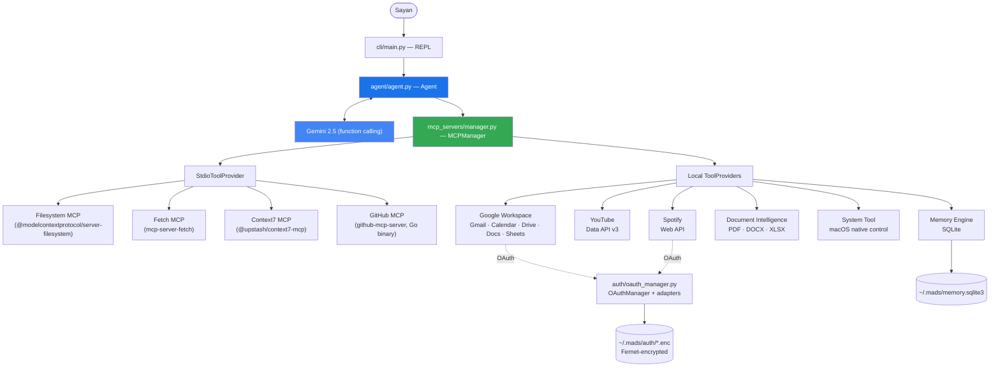

# Mads

Mads is a personal AI Chief of Staff — a CLI-based AI operating system built around one core
idea: **one brain, many tools.** Gemini decides what to do and which capability to use; there is
no keyword routing, no multi-agent orchestration, and no hardcoded "if X then call Y" logic
anywhere in the codebase. Every capability — reading a file, searching Gmail, controlling
Spotify, checking battery status — is just a function Gemini can choose to call.

## Why this architecture

Most "AI assistant" projects either hardcode intent → action mappings, or reach for multi-agent
frameworks before they're needed. Mads deliberately avoids both:

- **No keyword routing.** Nothing in this codebase inspects the user's message for words like
  `"email"` or `"volume"` to decide what to do. Gemini's function calling makes that decision
  every time, using the natural-language tool descriptions as its only guide.
- **No multi-agent orchestration.** There is one Gemini chat session per run. When a task needs
  several independent lookups (e.g. Research Mode fetching from Context7, GitHub, the web, and
  YouTube at once), those are *concurrent tool calls within the same reasoning turn*
  (`asyncio.gather`), not separate agent instances with their own reasoning loops.
- **Every capability looks the same to the agent.** Whether a tool spawns a real MCP server
  subprocess, calls a REST API directly, or shells out to `osascript`, the agent only ever sees a
  `ToolProvider`: `list_tools()` + `call_tool()`. It has no idea which is which, and doesn't need
  to.

## Architecture



**The agent never branches on tool identity.** `Agent.send()` sends a message, and for every
function call Gemini requests in that turn, dispatches to `MCPManager.call_tool(name, args)` —
that's the entire routing logic. `MCPManager` resolves `name` to whichever `ToolProvider`
registered it and returns the result. Independent calls in the same turn run concurrently.

## Request lifecycle


## What's inside

| Capability | Backed by | Tools |
|---|---|---|
| **Filesystem** | Official `@modelcontextprotocol/server-filesystem` (npx, stdio MCP) | 14 |
| **Fetch** | Official `mcp-server-fetch` (uvx, stdio MCP) | 1 |
| **Context7** | Official `@upstash/context7-mcp` (npx, stdio MCP) | 2 |
| **GitHub** | Official `github-mcp-server` Go binary, read-only mode (stdio MCP) | 26 |
| **Google Workspace** | Direct Gmail/Calendar/Drive/Docs/Sheets REST APIs (OAuth) — official per-app MCP servers exist but can't send/write or cover Docs/Sheets, so this calls the APIs directly | 20 |
| **YouTube** | Direct YouTube Data API v3 (API key) — the community MCP server for this is broken against current SDK versions | 4 |
| **Spotify** | Direct Spotify Web API (OAuth) | 2 (growing) |
| **Document Intelligence** | PyMuPDF, python-docx, openpyxl, reportlab — local only, no MCP | 6 |
| **System Tool** | `osascript`, `psutil`, native macOS commands — local only, no MCP | 13 (growing) |
| **Memory Engine** | SQLite (`~/.mads/memory.sqlite3`) — preferences, projects, decisions, people | 5 |

Where an official MCP server exists *and* covers what's needed (Filesystem, Fetch, Context7,
GitHub), Mads uses it. Where the official option is missing, broken, or too narrow (Google
Workspace write operations, YouTube transcripts, Spotify), Mads calls the real API directly
instead — but exposes it through the exact same `ToolProvider` interface, so the agent can't
tell the difference.

## Safety model

- **Filesystem-scoped.** Filesystem and Document Intelligence tools are confined to
  `FILESYSTEM_ROOT` (defaults to your home directory). Paths outside it are rejected before any
  read/write happens.
- **Destructive system operations require confirmation** (`shutdown`, `restart`, `empty_trash`,
  `delete_files`, `terminate_process`). Each takes a `confirmed: bool` parameter; the first call
  always returns `requires_confirmation: true` with no side effect. Gemini surfaces this to you in
  plain conversation, you confirm in your own words, and only then does Gemini re-call with
  `confirmed=true`. No blocking prompts inside a tool call, no special-cased agent logic — it's
  just another turn of ordinary function calling.
- **OAuth tokens are encrypted at rest** under `~/.mads/auth/<provider>.enc` (Fernet, key derived
  from `OAUTH_TOKEN_ENCRYPTION_KEY`), refreshed silently, and never logged or printed.

## Getting started

```bash
git clone <this-repo>
cd mads
cp .env.example .env   # fill in GEMINI_API_KEY at minimum; other integrations are optional
uv sync
uv run mads
```

See `.env.example` for every integration's required variables — each one is optional except
`GEMINI_API_KEY`; Mads simply shows `✗` in its startup banner for anything unconfigured and skips
it. GitHub also needs its Go binary built once (`go install
github.com/github/github-mcp-server/cmd/github-mcp-server@latest`), and Google
Workspace/Spotify need one-time browser OAuth consent on first use.

## Project layout

```
mads/
├── agent/                    # The single agent: Gemini session, tool-call loop, prompts
├── auth/                     # Shared OAuthManager + per-provider adapters (Google, Spotify)
├── cli/                      # REPL entrypoint
├── config/                   # Typed Settings, loaded once from environment
├── mcp_servers/
│   ├── manager.py            # ToolProvider protocol + MCPManager
│   └── servers/               # One module/subpackage per capability
├── memory/                   # SQLite-backed memory engine + static profile
└── pyproject.toml
```

Note: Please add your personal information to `memory/profile.md`. This will help Mads personalize its responses and retain relevant long-term context.